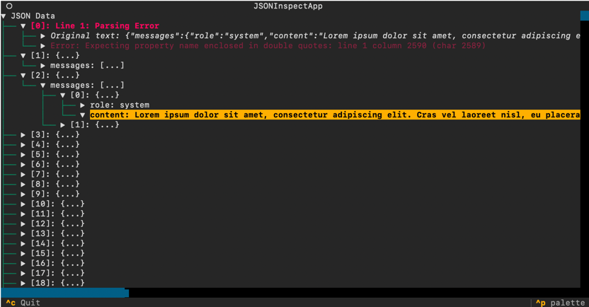

# jsonl-visualize

jsonl-visualize is a Terminal User Interface (TUI) application that allows you to visually inspect and navigate JSON and JSONL (JSON Lines) data. It provides an interactive tree view of your JSON structure, handles parsing errors gracefully, and allows for easy exploration of large JSON datasets.

With JSONL error handling:


With modal view for large strings:


## Features

- Interactive tree view of JSON and JSONL data
- Supports both single JSON objects and JSONL (multiple JSON objects, one per line)
- Graceful handling of parsing errors, displaying them inline with successfully parsed data
- Expandable error nodes showing original unparsable text and error messages
- Truncation of long text values with the ability to view full text in a modal
- Keyboard navigation for easy exploration of the JSON structure

## Installation

1. Ensure you have Python 3.7 or higher installed on your system.

2. Clone this repository:
   ```
   git clone https://github.com/gr-b/jsonl-visualize.git
   cd jsonl-visualize
   ```

3. Install the required dependencies:
   ```
   pip install textual
   ```

## Usage

You can use JSON Inspector in two ways:

1. With a JSON or JSONL file:
   ```
   python jsonl-visualize.py path/to/your/file.json
   ```

2. With piped input:
   ```
   cat path/to/your/file.json | python jsonl-visualize.py
   ```

### Keyboard Controls

- Arrow keys: Navigate the tree
- Enter: Expand/collapse nodes or view full text of truncated values
- 'q' or Ctrl+C: Quit the application
- 'b' or Escape: Go back from full text view to main tree view

## Error Handling

When jsonl-visualize encounters a parsing error in a JSONL file, it will:

1. Display the error in red at the appropriate position in the tree.
2. Show the line number where the error occurred.
3. Allow you to expand the error node to see:
   - The original unparsable text
   - The specific error message

This allows you to inspect and debug issues in your JSON data easily.

## Limitations

- The application loads the entire JSON/JSONL file into memory, so it may not be suitable for extremely large files.
- Syntax highlighting is not provided for the JSON structure to maintain simplicity and performance.

## License

This project is licensed under the MIT License - see the LICENSE file for details.